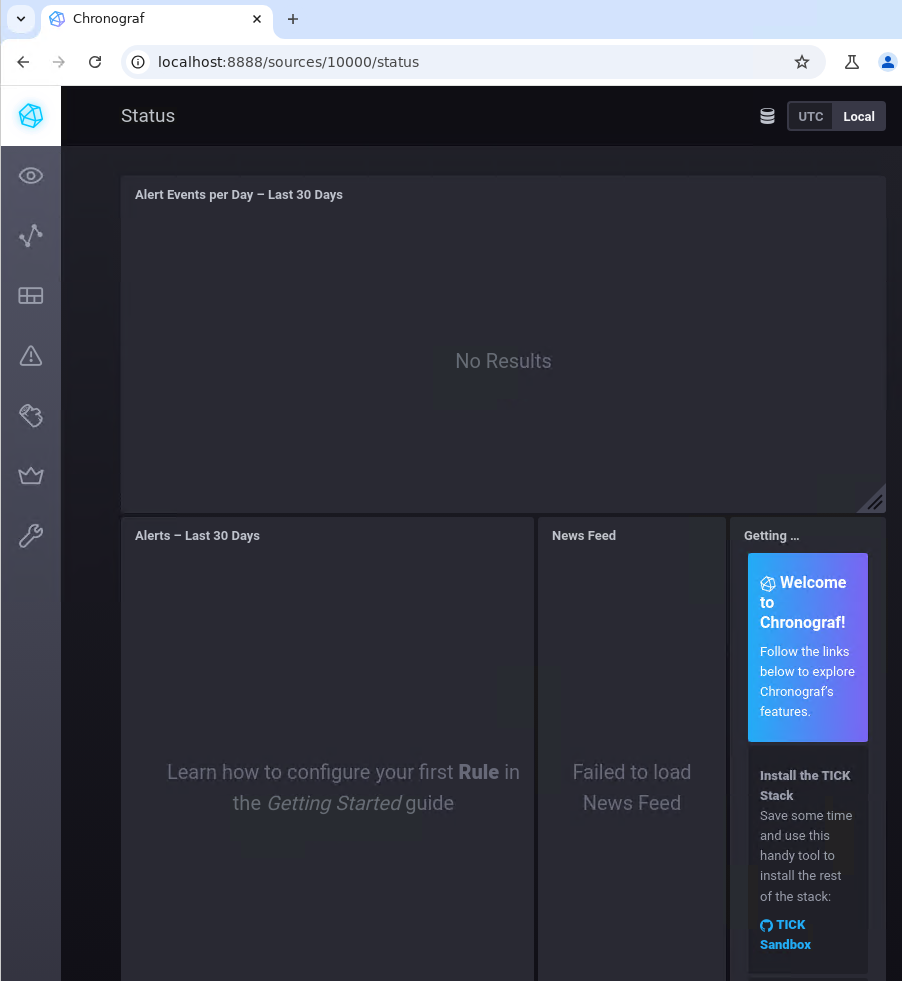
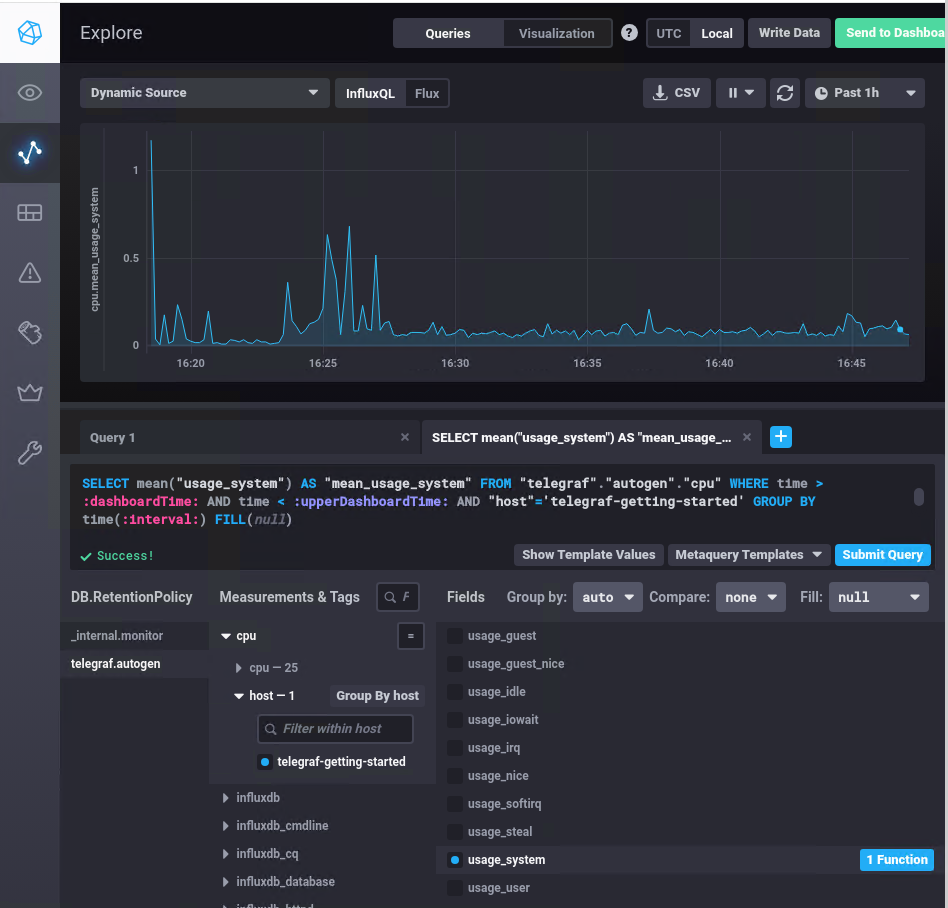
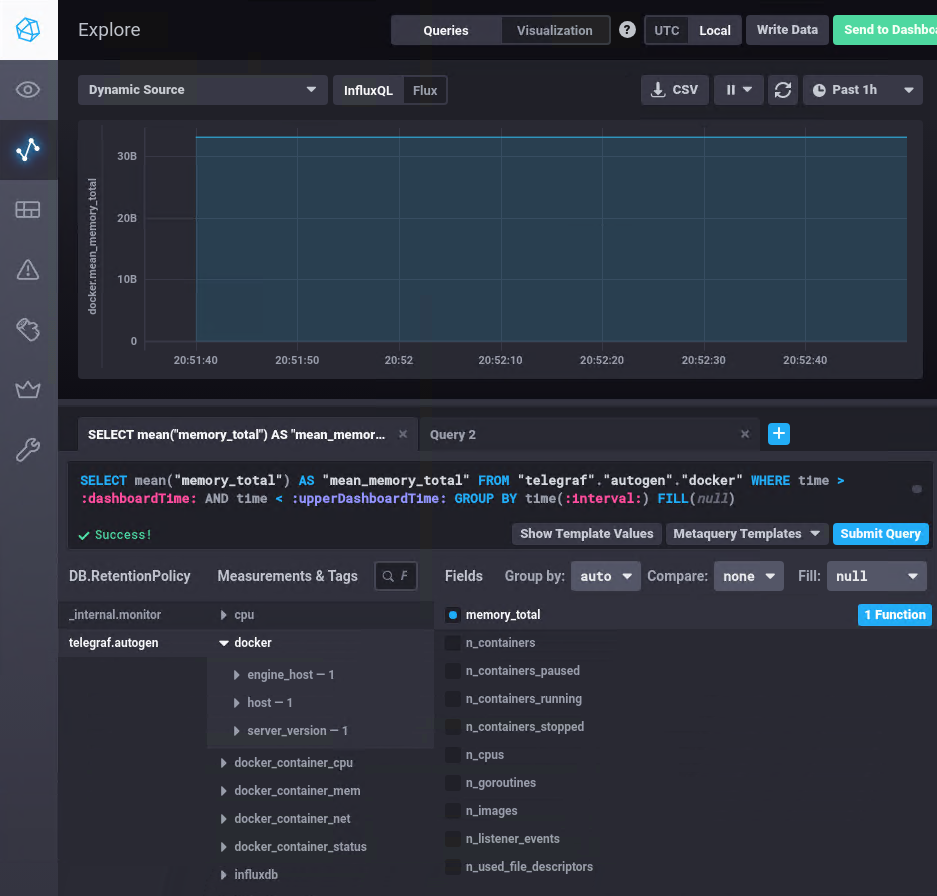

# Домашнее задание к занятию "13.Системы мониторинга"- Михалёв Сергей

## Обязательные задания

**1.** Вас пригласили настроить мониторинг на проект. На онбординге вам рассказали, что проект представляет из себя 
платформу для вычислений с выдачей текстовых отчетов, которые сохраняются на диск. Взаимодействие с платформой 
осуществляется по протоколу http. Также вам отметили, что вычисления загружают ЦПУ. Какой минимальный набор метрик вы
выведите в мониторинг и почему?

**Решение**

Минимальный набор метрик должен позволяь:
- отслеживать общую производительность системы (CPU, память, диск);
- следить за здоровьем HTTP-сервера и его реакцией на нагрузку;
- предотвращать возможные проблемы с дисковым пространством и задержками в выполнении вычислений;
- оперативно реагировать на критические ошибки и сетевые проблемы.
Список метрик:
- CPU Usage
- Memory Usage
- Disk Usage
- HTTP Metrics
- Processing Latency
- Network Metrics
- Application Logs/Error Rate

#
**2.** Менеджер продукта посмотрев на ваши метрики сказал, что ему непонятно что такое RAM/inodes/CPUla. Также он сказал, 
что хочет понимать, насколько мы выполняем свои обязанности перед клиентами и какое качество обслуживания. Что вы 
можете ему предложить?

**Решение**

Когда менеджер продукта говорит, что хочет понять, насколько команда выполняет свои обязанности перед клиентами и какое качество обслуживания, ему, скорее всего, нужно видеть метрики, ориентированные на бизнес-показатели и пользовательский опыт:
- SLO — целевой уровень качества обслуживания.
- SLA — соглашение об уровне обслуживания. 
- SLI — индикатор качества обслуживания. 

#
**3.** Вашей DevOps команде в этом году не выделили финансирование на построение системы сбора логов. Разработчики в свою 
очередь хотят видеть все ошибки, которые выдают их приложения. Какое решение вы можете предпринять в этой ситуации, 
чтобы разработчики получали ошибки приложения?

**Решение**

Большинство операционных систем Linux имеют встроенные механизмы для отправки системных и приложенческих логов через rsyslog или syslog. Вы можете настроить эти инструменты для отправки логов приложений в определённый файл, который разработчики могут просматривать.

#
**4** Вы, как опытный SRE, сделали мониторинг, куда вывели отображения выполнения SLA=99% по http кодам ответов. 
Вычисляете этот параметр по следующей формуле: summ_2xx_requests/summ_all_requests. Данный параметр не поднимается выше 
70%, но при этом в вашей системе нет кодов ответа 5xx и 4xx. Где у вас ошибка?

**Решение**

Ошибка заключается в том, что формула для расчета SLA использует только коды 2xx (успешные запросы) и все запросы (summ_all_requests), но игнорирует другие возможные коды ответов, такие как 3xx (редиректы), которые также считаются успешными, но не попадают в диапазон 2xx.

#
**5.** Опишите основные плюсы и минусы pull и push систем мониторинга.

**Решение**

Плюсы Pull-системы:
1. Централизованное управление. Сервер мониторинга сам решает, с каких узлов запрашивать данные и с какой частотой. Это облегчает управление и конфигурацию мониторинга.
2. Контроль данных. Поскольку запросы инициируются с сервера мониторинга, легче управлять частотой опросов и объемом собираемых данных. Это помогает контролировать нагрузку на сеть и системы.
3. Автоматическое обнаружение целей. Многие системы, такие как Prometheus, поддерживают автоматическое обнаружение новых узлов или сервисов для мониторинга. Это полезно в динамических средах, таких как Kubernetes, где объекты могут часто меняться.
4. Безопасность. Меньше проблем с безопасностью, так как центральный сервер запрашивает данные у целевых объектов, и целевые системы не инициируют отправку данных. Это снижает риски по экспонированию данных вовне.
5. Гибкость запросов. Централизованный сервер может запрашивать только нужные метрики, а не получать всё сразу. Это помогает оптимизировать сбор данных и анализ.
Минусы Pull-системы:
1. Сложность работы с распределенными системами. Если целевые объекты находятся за фаерволами или NAT, сервер мониторинга может не иметь к ним доступ. Это требует дополнительной настройки (например, проксирования или туннелирования).
2. Масштабируемость. В масштабных системах, где тысячи узлов или микросервисов, pull-система может столкнуться с проблемами масштабируемости. Центральному серверу будет сложнее опрашивать большое количество агентов и агрегировать данные.
3. Ограничения реального времени. Задержка между опросами может влиять на актуальность данных. Данные собираются с некоторой периодичностью, а не мгновенно.

Плюсы Push-системы:
1. Хорошая работа в распределенных системах. В распределённых системах push-система более удобна, так как агенты сами отправляют данные на сервер мониторинга, независимо от сетевых ограничений (например, NAT или фаерволов). Это облегчает сбор данных с внешних источников или с машин, находящихся в разных сетях.
2. Масштабируемость. Легче масштабировать систему мониторинга, так как нагрузка на центральный сервер распределяется на агентов. Они сами решают, когда и как отправлять метрики, а сервер лишь агрегирует и обрабатывает их.
3. Реагирование на события в реальном времени. В push-системах данные могут передаваться моментально по наступлению событий, что позволяет быстрее реагировать на проблемы и улучшает актуальность метрик.
4. Гибкость агентов. Агенты могут быть настроены для отправки только тех данных, которые нужны, что может улучшить производительность и уменьшить объем передаваемой информации.
Минусы Push-системы:1
1. Сложность конфигурации. Нужно настроить каждого агента для отправки данных в центральную систему, что может усложнить управление в больших системах. Агенты требуют конфигурации для правильного формата отправки данных и частоты отправки.
2. Нагрузка на сервер. Если большое количество агентов отправляет данные одновременно, это может создать пиковую нагрузку на сервер мониторинга. Необходима хорошая архитектура для обработки больших объемов входящих данных.
3. Безопасность. Агенты могут пытаться отправлять данные на центральный сервер мониторинга, что создаёт потенциальные риски безопасности. Нужно обеспечить, чтобы только доверенные агенты могли отправлять данные, а данные были защищены во время передачи.
4. Потенциальная потеря данных. Если сервер мониторинга временно недоступен, push-система может потерять данные, если агенты не настроены на буферизацию метрик. Без надлежащих механизмов резервирования данные могут просто не дойти до сервера.

#
**6.** Какие из ниже перечисленных систем относятся к push модели, а какие к pull? А может есть гибридные?

    - Prometheus 
    - TICK
    - Zabbix
    - VictoriaMetrics
    - Nagios
      
**Решение**

- к push модели относится TICK.
- к pull модели относится Nagios
- Prometheus, Zabbix и VictoriaMetrics могут относиться к обеим модулем, в зависимости от схемы мониторинга.
#
**7.** Склонируйте себе [репозиторий](https://github.com/influxdata/sandbox/tree/master) и запустите TICK-стэк, 
используя технологии docker и docker-compose.

В виде решения на это упражнение приведите скриншот веб-интерфейса ПО chronograf (`http://localhost:8888`). 

P.S.: если при запуске некоторые контейнеры будут падать с ошибкой - проставьте им режим `Z`, например
`./data:/var/lib:Z`

**Решение**

Скринщот первой страницы</br>
   </br>

#
**8.** Перейдите в веб-интерфейс Chronograf (http://localhost:8888) и откройте вкладку Data explorer.
        
    - Нажмите на кнопку Add a query
    - Изучите вывод интерфейса и выберите БД telegraf.autogen
    - В `measurments` выберите cpu->host->telegraf-getting-started, а в `fields` выберите usage_system. Внизу появится график утилизации cpu.
    - Вверху вы можете увидеть запрос, аналогичный SQL-синтаксису. Поэкспериментируйте с запросом, попробуйте изменить группировку и интервал наблюдений.

**Решение**

Скриншот  с отображением метрик утилизации cpu из веб-интерфейса</br>
   </br>

Для выполнения задания приведите скриншот с отображением метрик утилизации cpu из веб-интерфейса.
#
**9.** Изучите список [telegraf inputs](https://github.com/influxdata/telegraf/tree/master/plugins/inputs). 
Добавьте в конфигурацию telegraf следующий плагин - [docker](https://github.com/influxdata/telegraf/tree/master/plugins/inputs/docker):
```
[[inputs.docker]]
  endpoint = "unix:///var/run/docker.sock"
```

Дополнительно вам может потребоваться донастройка контейнера telegraf в `docker-compose.yml` дополнительного volume и 
режима privileged:
```
  telegraf:
    image: telegraf:1.4.0
    privileged: true
    volumes:
      - ./etc/telegraf.conf:/etc/telegraf/telegraf.conf:Z
      - /var/run/docker.sock:/var/run/docker.sock:Z
    links:
      - influxdb
    ports:
      - "8092:8092/udp"
      - "8094:8094"
      - "8125:8125/udp"
```

После настройке перезапустите telegraf, обновите веб интерфейс и приведите скриншотом список `measurments` в 
веб-интерфейсе базы telegraf.autogen . Там должны появиться метрики, связанные с docker.

Факультативно можете изучить какие метрики собирает telegraf после выполнения данного задания.

**Решение**

Скринщот список `measurments` в веб-интерфейсе базы telegraf.autogen c метриками, связанными с docker</br>
   </br>


---
